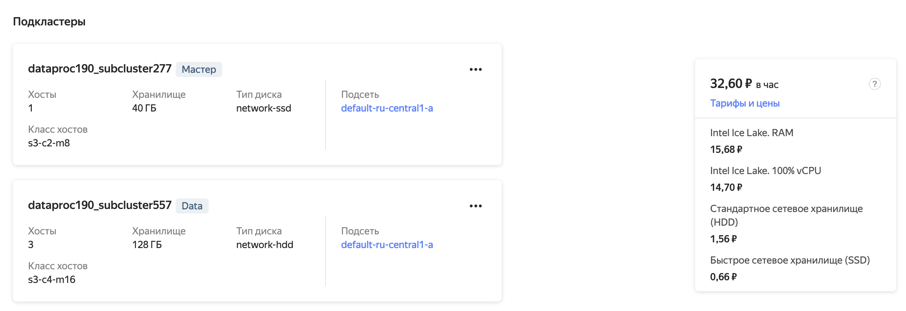
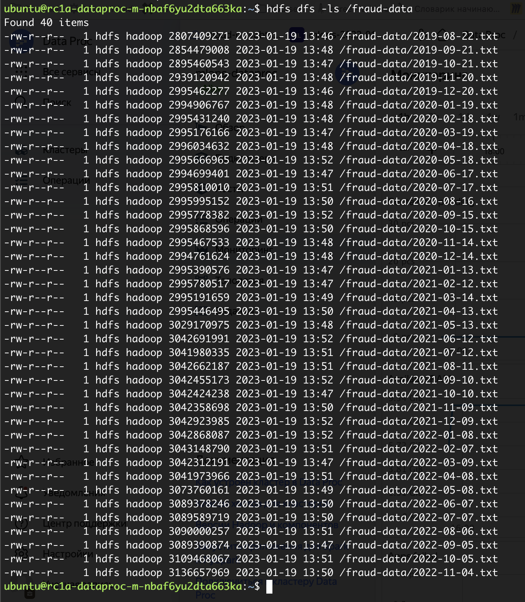
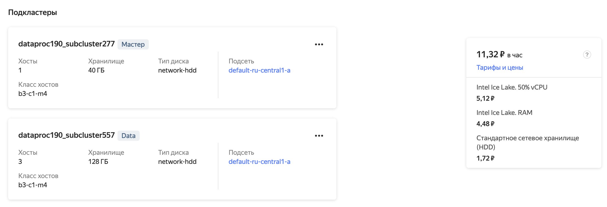

# Настройка облачной инфраструктуры для проекта по определению мошеннических транзакций

## S3 bucket

```
s3://mlops-data-nr/fraud-data/
```

Настройки `~/.s3cmd` для подключения:

```ini
[default]
access_key = ******
secret_key = ******
bucket_location = ru-central1
host_base = storage.yandexcloud.net
host_bucket = %(bucket)s.storage.yandexcloud.net
```

## Ресурсы кластера DataProc



## Данные в HDFS



## Сравнение затрат на S3 и HDFS

Стоимость хранения ~ 120 GB данных.

|                                |          S3          |         HDFS         |
|:------------------------------:|:--------------------:|:--------------------:|
| Хранение 120 GB данных, ₽/час  |                      |        32.60         |
| Хранение 120 GB данных, ₽/день |         6.50         |        782.4         |

Разница в 2 порядка.

В сравнении не учтены:

- затраты на операции чтения / записи данных
- рабочее время на администрирование кластеров
- заполненность дискового пространства в кластере DataProc, который развернут, как на скриншоте выше

## Оптимизация затрат на кластер DataProc

На данный момент производительность CPU и операций чтения / записи данных не критична. На DFS свободно 56% дискового пространства.

Что можем урезать для экономии:

1. Классы хостов заменить со `standard` на `burstable` с гарантированной долей CPU 50%, это минимальная доля из доступных конфигураций.
2. Тип дисков на подкластере master заменить с `network-ssd` на `network-hdd`.
3. Уменьшить выделенное дисковое пространство для хостов подкластера data. Стоимость дисков составляет ~ 6% от стоимости кластера, экономия будет незначительная при наших объёмах.

Итого стоимость удалось снизить в 3 раза:

|               | DataProc,<br/>исходная конфигурация | DataProc,<br/>оптимизированный |
|:-------------:|:-----------------------------------:|:------------------------------:|
|  vCPU, ₽/час  |                14.70                |              5.12              |
|  RAM, ₽/час   |                15.68                |              4.48              |
|  SSD, ₽/час   |                0.66                 |               0                |
|  HDD, ₽/час   |                1.56                 |              1.72              |
| Итого,  ₽/час |              **32.6**               |           **11.32**            |
| Итого,  ₽/мес |             **23 472**              |           **8 150**            |


