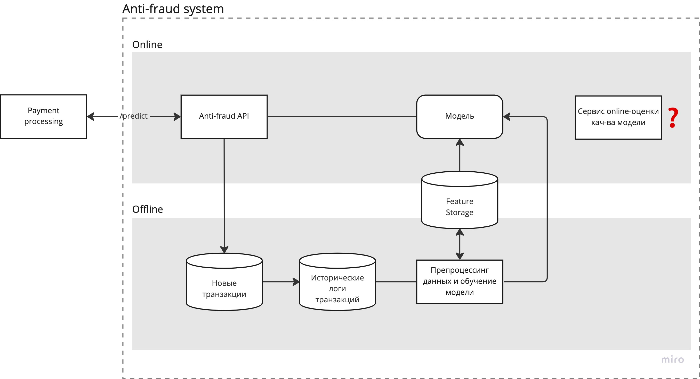

# Анти-фрод система

## Цели системы

Свести к минимуму количество мошеннических операций по банковским картам с помощью антифрод-системы на основе ML.

Доля выполненных мошеннических операций должна быть снижена до 2% от общего числа транзакций, при этом сумма средств по ним не должна превышать 500 тыс. ₽ в месяц. Доля корректных клиентских транзакций, отклонённых системой как мошеннические, не должна превышать 5%. Выполнение этих требований необходимо для того, чтобы компания была конкурентоспособной.

На исследование и внедрение MVP допустимо потратить до 3 месяцев. В результате должно быть принято решение, достижимы ли указанные выше показатели. В случае положительного решения, проект нужно завершить за полгода.

## Ключевая метрика ML

- `Recall >= 0.98` позволит максимизировать долю обнаруженных среди всех мошеннических операций

$$ Recall = {{TP} \over {TP + FN}} $$

- `Precision >= 0.95` позволит минимизировать долю корректных клиентских транзакций, заблокированных системой как мошеннические

$$ Precision = {{TP} \over {TP + FP}} $$

- `F1 >= 0.965` - комбинация Precision и Recall, удобная для оптимизации алгоритма

$$ F1 = {2 * {{Precision * Recall} \over {Precision + Recall}}} $$

| |Positive (истинно мошенническая) |Negative (истинно клиентская) |
|:----------------:|:-------------------------------:|:-----------------------------:|
|Positive (предсказана как мошенническая) |TP True Positive |FP False Positive |
|Negative (предсказана как клиентская) |FN False Negative |TN True Negative |

## Canvas проекта

## Дизайн системы

